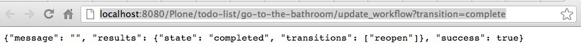

.. line-block::

    WARNING: If you are reading this on GitHub, DON'T! Read it on ReadTheDocs:
    http://tutorialtodoapp.readthedocs.org/en/latest/chapter_3.html so you
    have working references and proper formatting.

.. index::
   single: Bling-bling ajax view

======================
Chapter 4: Bling-bling
======================

As a reward for making it all the way to the end, we will help you add some
fancy features to your project, otherwise known as bling and that means having
to write JavaScript. Fortunately Plone comes with jQuery so we can easily
integrate.

The final part of this tutorial will allow users to check and un-check items on
their todo list  without having to load a new page request. Note that by
developing the functionality in this order, 100% of the functionality of the
application remains working even when javascript is disabled. Win!

AJAX view
=========

Before we add front-end bling, we need some code that can handle these requests
coming in. Let's create a simple view that will update the object in context to
a new state. Go to GitHub and copy the code for ``WorkflowTransition`` class
in ``todo.py``. This class represents a view that our AJAX code will
call. You can also get the code with git, however note that now we are checking
out code from master, as Chapter 4 is the last chapter and its code is in
the master branch.

.. code-block:: bash

   $ git checkout master src/tutorial/todoapp/todo.py

Take a look at the ``WorkflowTransition`` class and comments around the
code. There are a couple of things to point out specific to this setup:

.. code-block:: python

    grok.context(Container)

Tells us that this view should be called in the context of a Dexterity
Container item. So if you try to go to this view from the portal root or
anywhere in the site that is not a Dexterity item, Plone will return a 404 -
not found error. By default all Dexterity types that you create TTW are based
on the Dexterity Container base class.

.. code-block:: python

    grok.name('update_workflow')

This tells us on which URL the view will be available on. In this case, on
``<url_to_plone_content_object>/update_workflow``.

.. code-block:: python

    def render(self):

``render`` is a special function that must be used. It is where all of the code
must go when used with grok directives. This is the main block of code that
will be executed.

.. code-block:: python

    transition = self.request.form.get('transition', '')

``self.request`` is set by the base class, and anything based on BrowserView
will have access to this variable. All of GET/POST parameters will be stored
in ``self.request.form``.

.. code-block:: python

        self.request.response.setHeader(
            'Content-Type', 'application/json; charset=utf-8')
        return json.dumps(results)

When working with JSON, it's not *required* to set the header content type, but
when used with certain jQuery calls it is expected to have the header set
correctly. If you don't set this, it will sometimes work and sometimes not. Get
used to setting it!

Additionally, we return the result serialized as json by default. For making
and testing JSON web service calls, keep in mind that they should do exactly
one thing and no more. This makes it easy to integrate with Javascript and VERY
easy to test. We'll see later on how easy it is to test this view.

Furthermore, before taking the plunge to wire up JavaScript, go directly to the
url and test the change. For example, if you have an item at
``http://localhost:8080/Plone/todo-list/go-to-the-bathroom``, you can test the
view by appending the view name and GET variables to the end of the item's url.
However, you first need to restart your Zope first, so your Python files get
reloaded!

.. code-block:: bash

    http://localhost:8080/Plone/todo-list/go-to-the-bathroom  + update_workflow?transition = complete

    http://localhost:8080/Plone/todo-list/go-to-the-bathroom/update_workflow?transition=complete

For extra clarity: if you are not an expert in python, plone, AND javascript, I
highly recommend integrating bling bling in the following order:

    #. Write base view and **passing** test cases
    #. Test views in browser
    #. Make ajax interactive

Starting with bling from the start will only bring you pain.

Custom JavaScript
=================

Now that we know the ``update_workflow`` view is working, let's add some AJAX
handling on the top of it. Checkout the Javascript file and a JavaScript
registry file into your working directory:

.. code-block:: bash

    git checkout master src/tutorial/todoapp/static/todoapp.js
    git checkout master src/tutorial/todoapp/profiles/default/jsregistry.xml

``jsregistry.xml`` contains all configuration needed to tell Plone how it
should register and use our JavaScript. It has a lot of options that are pretty
self explanatory (if you think like a machine).

.. literalinclude:: ../src/tutorial/todoapp/profiles/default/jsregistry.xml
    :linenos:

Trying it out!
==============

Holy moley you made it! Restart Zope (to reload Python files), reactivate the
product (to reimport XML files), do a hard reload in your web browser (to clear
any caches) and check out your todo list. The todo items should toggle between
complete and incomplete without the page reloading. Sweet!

Tests
=====

As always, let's add tests!  First add the following snippet to ``test_setup``
to verify that your JavaScript is registered in Plone.

.. code-block:: python

   # jsregistry.xml
   def test_js_registered(self):
       """Test that todoapp.js file is registered in portal_javascript."""
       resources = self.portal.portal_javascripts.getResources()
       ids = [r.getId() for r in resources]

       self.assertIn('++resource++tutorial.todoapp/todoapp.js', ids)

Lastly, add a new test module: ``test_workflow.py``. Download it from GitHub,
put and it in your ``tests`` folder and run tests. Then fiddle around with it
to see what it does. As always, you can use git to get the file.

   .. code-block:: bash

      $ git checkout master src/tutorial/todoapp/tests/test_workflow.py

The end
=======

This concludes the Todo app in Plone tutorial. Congratulations! Now it's time
to checkout other tutorials and documentation available on `developer.plone.org
<http://developer.plone.org>`_!

Troubleshooting
===============

If something goes wrong you can always go to GitHub and see how the `code
in master <https://github.com/collective/tutorial.todoapp/>`_
should look like and compare this to what you have on your local machine.

